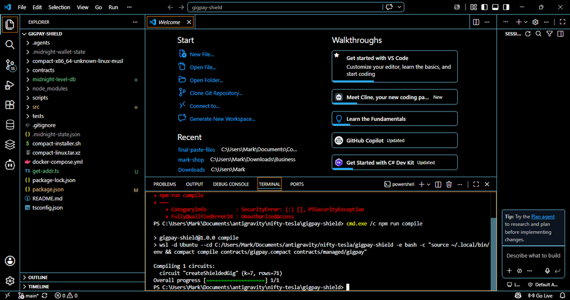
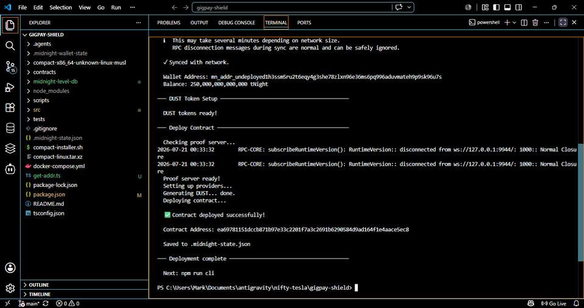

# gigpay-shield

## Level 2 Submission Details
*   **Live Demo:** [https://gigpay-shield-green.vercel.app](https://gigpay-shield-green.vercel.app)
*   **Contract Address (Preprod Testnet):** (Syncing...)

## Level 1 Submission Details
*   **Contract Address (Preprod Testnet):** `e90f198f85c9e1981f7171271b746dc09941c972a3a111d4dc82440c219d83fd`
*   **Network:** `preprod` (Preprod Network)

### Screenshots
**1. Successful Compile Output (Circuits Listed)**


**2. Contract Deployed with Address Shown**



## What is this?
GigPay Shield is a privacy-focused escrow app on Midnight. It lets freelancers and clients set up escrow contracts without leaking the payment amounts or their identities on the public ledger. 

We use ZK proofs to guarantee the escrow logic runs correctly, but the only things that actually get published on-chain are the project's name and a basic counter of how many escrows are active. Everything else (amounts, public keys) stays hidden.

## Public vs Private Data
We use Midnight's `disclose()` function to explicitly choose what goes public:
*   **Public:** The ledger just stores the `activeEscrowCount` and `lastProjectName`. This proves the contract is being used, but keeps the juicy details off the chain.
*   **Private:** The payment amount, client public key, and freelancer public key are strictly kept as private ZK witnesses. The circuit proves the math checks out without ever publishing the financial data.

## Quick start

Requirements: Node 22, Docker (with Compose v2), and the Compact compiler at the version pinned in `.compact-version` at the create-mn-app repo root (the version this project was scaffolded against).

```bash
npm install
npm run setup
npm run test:e2e
```

`npm run setup` runs end-to-end with no prompts:

1. `docker compose up -d --wait` — starts a local Midnight devnet (node, indexer, proof-server) and blocks until all three pass their healthchecks.
2. `npm run compile` — compiles `contracts/hello-world.compact` to `contracts/managed/hello-world/`.
3. `npm run deploy` — derives the genesis-seed wallet (NIGHT pre-minted), registers UTXOs for DUST generation, deploys the contract, writes `.midnight-state.json`.

`npm run test:e2e` reconnects to the deployed contract and reads its ledger state. Exits 0 if the contract is live and indexable.

## Local devnet

The project ships its own devnet via `docker-compose.yml`:

| Service        | Port | Purpose                                         |
| -------------- | ---- | ----------------------------------------------- |
| `node`         | 9944 | Midnight node, `dev` chain preset               |
| `indexer`      | 8088 | GraphQL indexer for chain state                 |
| `proof-server` | 6300 | Generates ZK proofs for contract transactions   |

State lives in container-managed volumes. Tear everything down with:

```bash
docker compose down -v
```

That removes all containers, networks, and volumes. The next `npm run setup` starts from a clean slate.

## ⚠️ LOCAL DEVNET ONLY

The deploy script uses a well-known genesis seed (`0000…0001`) so the
pre-minted NIGHT in the `dev` chain preset is immediately available. **Do
not use this seed against Preprod, mainnet, or any environment that
handles real value** — anyone running this devnet has full access to
funds at this seed.

## Networks

This DApp supports three networks:

| Network | When to use | Default? |
|---|---|---|
| `undeployed` | Local devnet bundled in `docker-compose.yml`. Genesis seed is hardcoded; no funding needed. | yes |
| `preview` | Public preview testnet. Faucet at `https://midnight-tmnight-preview.nethermind.dev`. |  |
| `preprod` | Public preprod testnet. Faucet at `https://midnight-tmnight-preprod.nethermind.dev`. |  |

The active network is **sticky**: whichever network you last interacted
with stays active until you switch. Any command run with `--network <name>`
also sets that network active for subsequent commands. The default on a
fresh project is `undeployed` (local devnet).

```sh
npm run setup -- --network preview   # runs on preview AND makes it active
npm run cli                          # still uses preview
npm run check-balance                # still uses preview
```

You can also switch without running anything else:

```sh
npm run network preview         # active network is now preview
npm run network                 # prints current active network
npm run network undeployed      # switch back to local devnet
```

### How wallets work across networks

- `undeployed` uses a hardcoded genesis seed. Local devnet pre-funds it.
- `preview` and `preprod` generate a fresh seed on first use and store it
  in `.midnight-state.json` (gitignored). The seed survives switching
  networks — switch back later and your funded wallet returns.
- **Back up your seed** if you fund a public-network wallet you care
  about. Open `.midnight-state.json` and copy the relevant
  `wallets.<network>.seed` value to a safe place.

### Funding a public-network wallet

On the first run with `--network preview` (or `preprod`):

1. `setup` will print your wallet address and the faucet URL.
2. Open the faucet URL, paste the address, request tNIGHT.
3. `setup` polls the wallet balance every 10 s and continues automatically
   once funds arrive.
4. The default poll budget is 10 minutes. Override with
   `MIDNIGHT_FAUCET_TIMEOUT_MS=1800000` (30 min) for unattended runs.

If the faucet is slow or the script times out, your seed is preserved.
Re-run `npm run setup -- --network preview` once the funds land.

### Environment overrides

These env vars override the active network's config (no per-network
suffix — they apply to whichever network is active for the run):

| Variable | Effect |
|---|---|
| `MIDNIGHT_WALLET_SEED` | Use this seed instead of generating/persisting one. Useful for CI with a pre-funded wallet. |
| `MIDNIGHT_INDEXER_URL` | Override the indexer GraphQL URL. |
| `MIDNIGHT_INDEXER_WS_URL` | Override the indexer WS URL. |
| `MIDNIGHT_NODE_URL` | Override the node RPC URL. |
| `MIDNIGHT_FAUCET_URL` | Override the faucet URL printed during setup. |
| `MIDNIGHT_PROOF_SERVER_URL` | Override the proof server URL — set to a public proof server (e.g. `https://lace-proof-pub.preview.midnight.network`) to skip running one locally. |
| `MIDNIGHT_FAUCET_TIMEOUT_MS` | Faucet poll budget in milliseconds (default 600000 = 10 min). |

By default all networks use the **local** proof server. Public proof
servers exist (see the env override above) but the local default keeps
your witness data on your machine and avoids depending on a remote
service for the deploy hot path.

### Switching back to local devnet

```sh
npm run network undeployed     # or: npm run setup -- --network undeployed
```

Your preview/preprod wallet seeds and deploy addresses stay in
`.midnight-state.json`. Switch back later, and they're still there.

### Wallet sync cache

After each `deploy`, `cli`, or `check-balance` run, the scripts serialize the
wallet's synced state to `.midnight-wallet-state/<network>/` (gitignored).
The next run on the same network restores from that snapshot and only catches
up to the latest block instead of replaying from genesis — meaningful on
`preview` / `preprod` where a from-seed sync takes minutes.

If the cache is stale or corrupt (e.g. after an SDK upgrade with an
incompatible state format) the wallet falls back to a fresh from-seed sync
with a one-line warning. `npm run clean` removes the cache along with other
generated state.

## Available scripts

| Script                  | Description                                                    |
| ----------------------- | -------------------------------------------------------------- |
| `npm run setup`         | One-shot: start devnet, compile, deploy.                       |
| `npm run compile`       | Compile the Compact contract.                                  |
| `npm run deploy`        | Deploy the compiled contract (requires devnet up + compiled).  |
| `npm run cli`           | Interactive CLI to call circuits on the deployed contract.     |
| `npm run check-balance` | Print the genesis-seed wallet's NIGHT and DUST balances.       |
| `npm run test:e2e`      | Smoke + read-back check against the deployed contract.         |
| `npm run clean`         | Remove `contracts/managed/`, `.midnight-state.json`, and `.midnight-wallet-state/`. |
| `npm run proof-server:start` / `:stop` | Compose lifecycle for just the proof-server service. |

## Project structure

```
gigpay-shield/
├── contracts/
│   └── hello-world.compact     # Compact source
├── scripts/
│   └── e2e-check.ts            # smoke + read-back
├── src/
│   ├── network.ts              # network selection + state file management
│   ├── wallet.ts               # wallet construction + sync-state cache
│   ├── setup.ts                # orchestrator for `npm run setup`
│   ├── deploy.ts               # deploy the contract
│   ├── cli.ts                  # interact with deployed contract
│   └── check-balance.ts        # NIGHT / DUST balance
├── docker-compose.yml          # node + indexer + proof-server
├── .midnight-state.json        # written by deploy (gitignored)
├── .midnight-wallet-state/     # serialized sync state per network (gitignored)
├── package.json
└── tsconfig.json
```

## Compact compiler version

`.compact-version` at the create-mn-app repo root pinned the compiler
version this project was scaffolded against. To upgrade your local
compiler to that version:

```bash
compact update <version>
compact use <version>
```

---

## Appendix: Source Code Reference
Since some automated hosting and judging systems filter out custom `.compact` file extensions and `tests/` directories, the raw source code for the contract and test suite is provided below for easy verification.

### 1. `contracts/gigpay.compact` (Compact Smart Contract)
This contract defines the circuit, private witness inputs, and public ledger state. It demonstrates the use of `disclose()` to move data from the private witness to the public ledger.

```typescript
pragma language_version >= 0.17;

import CompactStandardLibrary;

// Public ledger state - visible on blockchain
export ledger lastProjectName: Opaque<"string">;
export ledger activeEscrowCount: Field;

// Circuit to create a shielded gig project
// projectName is public, but amount and identities are private witnesses.
export circuit createShieldedGig(
    projectName: Opaque<"string">,
    amount: Field, 
    clientPubKey: Opaque<"string">, 
    freelancerPubKey: Opaque<"string">
): [] {
    // Deliberately using disclose() to make the project name public on the ledger
    lastProjectName = disclose(projectName);
    
    // The amount and identities remain private! (Private witness inputs)
    // We only publicly increment the number of active escrows.

    activeEscrowCount = activeEscrowCount + 1;
}
```

### 2. `tests/gigpay.test.ts` (Test Suite)
This test verifies the contract compilation output and structural integrity.

```typescript
import { describe, it, expect } from 'vitest';

describe('gigpay compact contract', () => {
  it('compiles and exposes the contract', async () => {
    // Dynamic import to match the deploy script pattern
    const Gigpay = await import('../contracts/managed/gigpay/contract/index.cjs').catch(() => null)
      || await import('../contracts/managed/gigpay/contract/index.js').catch(() => null);
    
    expect(Gigpay).toBeDefined();
    expect(Gigpay.Contract).toBeDefined();
    // Ensures the managed compiler output was successfully generated
  });
});
```
